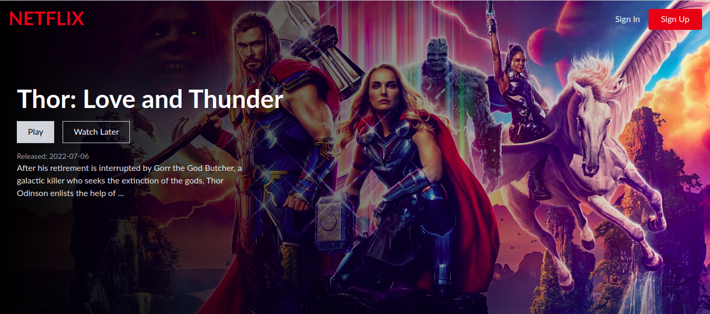
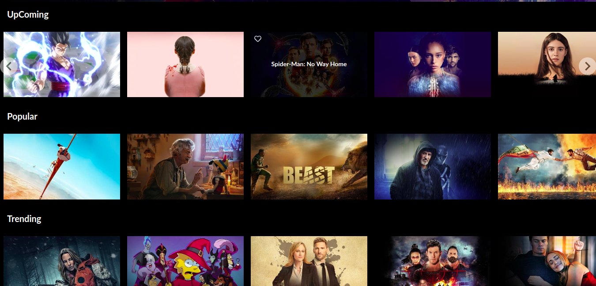

# NETFLIX-CLONE

## Top Page Screenshot

## Movies Rows

# Description

I used the TMDB API for all of the data and  Firebase Authentication to give login functionality.Stored user specific data with a React front-end and a Firebase back-end. I used Firestore which is cloud storage with Firebase to save data. The front-end is styled with Tailwind CSS - an incredible CSS framework to save time styling .

# Project-Setup-Instructions

1)Installation of the Visual studio code .

2)Git cloning the repository . 

3)install the app dependancies by running npm install

4)After the node-modules packages and other dependancies have been installed run npm start or npm run start to run the app/ yarn start

# Technology-Used
HTML - Was used as a template to hold the React components of the app via the root div. CSS styling-which was used to style the User Interface. JS - JavaScript is used to make the website interactive. JSX- JavaScript XML allows us to write HTML elements in JavaScript and place them in the DOM .JSX converts HTML tags into react elements. JSON-Was used to create a public API server which was hosted on Heroku. Netlify- Netlify was used to deploy the project's live link. Heroku - Heroku used to create a Json-server API that's hosted online .

# Known-Bugs

The front-end is working properly.
Yet to implement the backend.

# Development

Want to contribute? Excellent!

To enhance or contribute on the existing project, follow these steps:

Fork the repo
Create a new branch (git checkout -b enhance-feature)
Make the appropriate changes in the files
Add changes to reflect the changes made
Commit your changes (git commit -m 'enhanced feature')
Push to the branch (git push origin enhance-feature)

# License

Copyright (c) [2022][jackson otieno] Permission is hereby granted, free of charge, to any person obtaining a copy of this software and associated documentation files (the "Software"), to deal in the Software without restriction, including without limitation the rights to use, copy, modify, merge, publish, distribute, sublicense, and/or sell copies of the Software, and to permit persons to whom the Software is furnished to do so, subject to the following conditions:

The above copyright notice and this permission notice shall be included in all copies or substantial portions of the Software.

THE SOFTWARE IS PROVIDED "AS IS", WITHOUT WARRANTY OF ANY KIND, EXPRESS OR IMPLIED, INCLUDING BUT NOT LIMITED TO THE WARRANTIES OF MERCHANTABILITY, FITNESS FOR A PARTICULAR PURPOSE AND NONINFRINGEMENT. IN NO EVENT SHALL THE AUTHORS OR COPYRIGHT HOLDERS BE LIABLE FOR ANY CLAIM, DAMAGES OR OTHER LIABILITY, WHETHER IN AN ACTION OF CONTRACT, TORT OR OTHERWISE, ARISING FROM, OUT OF OR IN CONNECTION WITH THE SOFTWARE OR THE USE OR OTHER DEALINGS IN THE SOFTWARE.

# Author

By Jackson otieno.

# Support-And-Contact-Details

Email address: jacksonohallo@gmail.com
Slack:jackson otieno